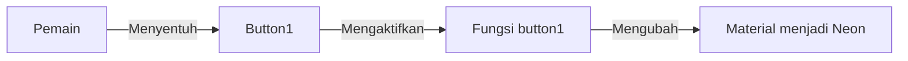

Mari saya jelaskan kode tersebut dengan analogi yang mudah dipahami:

### 🎮 Penjelasan Kode

```lua
function button1()
    game.Workspace.Button1.Material = Enum.Material.Neon
end
game.Workspace.Button1.Touched:Connect(button1)
```

### 📝 Analogi Sederhana

Bayangkan sebuah lampu di rumah Anda:

1. `function button1()` adalah seperti membuat saklar lampu
2. `game.Workspace.Button1` adalah lampunya
3. `Material = Enum.Material.Neon` adalah mengubah lampu biasa menjadi lampu neon
4. `Touched:Connect(button1)` adalah seperti menghubungkan saklar ke lampu

### 🎯 Visualisasi Proses



### 🔍 Cara Kerja
- Ketika pemain menyentuh objek Button1 di game
- Secara otomatis objek tersebut akan berubah menjadi material Neon
- Seperti menyentuh saklar yang membuat lampu biasa berubah menjadi lampu neon yang bersinar

### 💡 Contoh Dunia Nyata
Mirip seperti:
- Menyentuh layar smartphone yang awalnya gelap menjadi terang
- Menginjak keset pintu yang bisa menyala di malam hari
- Menyentuh lampu sentuh yang berubah warna