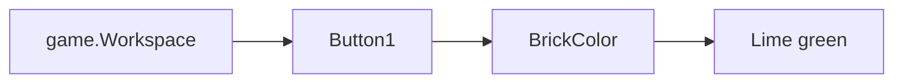

# Penjelasan Kode Roblox untuk Mengubah Warna

Mari kita breakdown kode berikut:

````lua
game.Workspace.Button1.BrickColor = BrickColor.new('Lime green')
````

## Analogi Sederhana 🎨

Bayangkan sebuah kotak cat dengan berbagai warna:
1. `game.Workspace` adalah seperti meja tempat kamu meletakkan semua barang
2. `Button1` adalah benda/objek yang ada di atas meja tersebut
3. `BrickColor` adalah seperti palet warna yang tersedia
4. `Lime green` adalah warna spesifik yang kamu pilih dari palet tersebut

## Penjelasan Detail 📝

Kode ini terdiri dari beberapa bagian:
- `game.Workspace` → Mengakses area kerja dalam game Roblox
- `Button1` → Nama objek yang akan diubah warnanya
- `BrickColor` → Properti yang mengatur warna objek
- `new('Lime green')` → Membuat warna baru dengan spesifikasi hijau limau

## Visualisasi Proses 🔄



**Hasil Akhir**: Ketika kode ini dijalankan, objek bernama "Button1" dalam game akan berubah warna menjadi hijau limau (lime green) 🟢